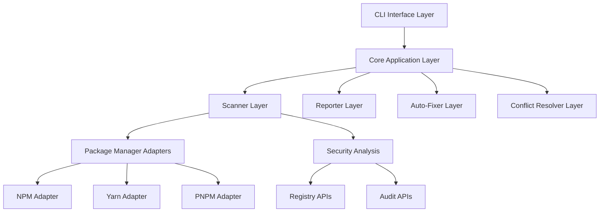

# Design Document: Depguardian

## Overview

Depguardian is a modular CLI tool built with TypeScript and Node.js that provides comprehensive dependency analysis, health reporting, and automated fixing capabilities for JavaScript/TypeScript projects. The architecture follows clean architecture principles with clear separation of concerns, enabling maintainability and extensibility.

The tool operates through a plugin-based scanner system that analyzes package.json, lockfiles, and node_modules to detect various dependency issues. It provides intelligent suggestions and automated fixes while maintaining compatibility across npm, yarn, and pnpm package managers.

## Architecture

The system follows a layered architecture with clear boundaries between components:



### Core Principles

1. **Modular Design**: Each component has a single responsibility and clear interfaces
2. **Package Manager Agnostic**: Adapters handle package manager-specific logic
3. **Extensible Scanner System**: Plugin-based architecture for different analysis types
4. **Immutable Operations**: All analysis operations are read-only until explicit fix commands
5. **Progressive Enhancement**: Basic functionality works without network access, enhanced features require API access

## Components and Interfaces

### CLI Interface Layer

The CLI layer provides the user-facing commands and handles argument parsing, output formatting, and progress indication.

```typescript
interface CLICommand {
  name: string;
  description: string;
  execute(args: CommandArgs): Promise<CommandResult>;
}

interface CommandArgs {
  projectPath: string;
  options: Record<string, any>;
}

interface CommandResult {
  success: boolean;
  output: string;
  exitCode: number;
}
```

**Commands:**
- `depguardian scan` - Analyze project dependencies
- `depguardian report` - Generate detailed health report
- `depguardian fix` - Apply automated fixes

### Core Application Layer

The core orchestrates all operations and maintains the application state.

```typescript
interface DependencyAnalyzer {
  analyze(projectPath: string): Promise<AnalysisResult>;
  generateReport(analysis: AnalysisResult): Promise<HealthReport>;
  suggestFixes(analysis: AnalysisResult): Promise<FixSuggestion[]>;
  applyFixes(fixes: FixSuggestion[]): Promise<FixResult>;
}

interface AnalysisResult {
  healthScore: number;
  issues: DependencyIssue[];
  packageManager: PackageManagerType;
  projectInfo: ProjectInfo;
  securityVulnerabilities: SecurityIssue[];
}
```

### Scanner Layer

The scanner layer detects various types of dependency issues through specialized scanners.

```typescript
interface DependencyScanner {
  scan(context: ScanContext): Promise<ScanResult>;
  getScannerType(): ScannerType;
}

interface ScanContext {
  projectPath: string;
  packageJson: PackageJson;
  lockfile: Lockfile;
  nodeModules: NodeModulesInfo;
  packageManager: PackageManagerAdapter;
}

enum ScannerType {
  OUTDATED = 'outdated',
  MISSING = 'missing',
  BROKEN = 'broken',
  PEER_CONFLICTS = 'peer-conflicts',
  VERSION_MISMATCHES = 'version-mismatches',
  SECURITY = 'security'
}
```

**Scanner Implementations:**
- **OutdatedScanner**: Compares current versions with latest available
- **MissingScanner**: Identifies packages in package.json but not in node_modules
- **BrokenScanner**: Detects corrupted or incomplete installations
- **PeerConflictScanner**: Analyzes peer dependency compatibility
- **VersionMismatchScanner**: Finds discrepancies between package.json and installed versions
- **SecurityScanner**: Checks for known vulnerabilities

### Package Manager Adapters

Adapters provide package manager-specific implementations while maintaining a consistent interface.

```typescript
interface PackageManagerAdapter {
  getType(): PackageManagerType;
  readLockfile(projectPath: string): Promise<Lockfile>;
  getInstalledPackages(projectPath: string): Promise<InstalledPackage[]>;
  installPackage(packageName: string, version?: string): Promise<void>;
  updatePackage(packageName: string, version: string): Promise<void>;
  regenerateLockfile(): Promise<void>;
}

enum PackageManagerType {
  NPM = 'npm',
  YARN = 'yarn',
  PNPM = 'pnpm'
}
```

### Reporter Layer

The reporter generates human-readable reports from analysis results.

```typescript
interface HealthReporter {
  generateReport(analysis: AnalysisResult): Promise<HealthReport>;
  formatForCLI(report: HealthReport): string;
  formatForJSON(report: HealthReport): string;
}

interface HealthReport {
  healthScore: number;
  summary: ReportSummary;
  outdatedPackages: OutdatedPackage[];
  securityIssues: SecurityIssue[];
  peerConflicts: PeerConflict[];
  recommendations: Recommendation[];
}
```

### Auto-Fixer Layer

The auto-fixer applies automated solutions to detected issues.

```typescript
interface AutoFixer {
  generateFixes(analysis: AnalysisResult): Promise<FixSuggestion[]>;
  applyFixes(fixes: FixSuggestion[]): Promise<FixResult>;
  createBackup(projectPath: string): Promise<BackupInfo>;
  restoreBackup(backupInfo: BackupInfo): Promise<void>;
}

interface FixSuggestion {
  type: FixType;
  description: string;
  risk: RiskLevel;
  actions: FixAction[];
  estimatedImpact: string;
}

enum FixType {
  INSTALL_MISSING = 'install-missing',
  UPDATE_OUTDATED = 'update-outdated',
  RESOLVE_CONFLICT = 'resolve-conflict',
  REGENERATE_LOCKFILE = 'regenerate-lockfile'
}
```

### Conflict Resolver Layer

The conflict resolver handles complex dependency conflicts that require sophisticated analysis.

```typescript
interface ConflictResolver {
  detectConflicts(analysis: AnalysisResult): Promise<Conflict[]>;
  resolveConflict(conflict: Conflict): Promise<Resolution>;
  validateResolution(resolution: Resolution): Promise<boolean>;
}

interface Conflict {
  type: ConflictType;
  packages: ConflictingPackage[];
  description: string;
  severity: ConflictSeverity;
}

interface Resolution {
  strategy: ResolutionStrategy;
  changes: PackageChange[];
  explanation: string;
  riskAssessment: RiskAssessment;
}
```

## Data Models

### Core Data Structures

```typescript
interface PackageJson {
  name: string;
  version: string;
  dependencies?: Record<string, string>;
  devDependencies?: Record<string, string>;
  peerDependencies?: Record<string, string>;
  optionalDependencies?: Record<string, string>;
}

interface DependencyIssue {
  type: IssueType;
  packageName: string;
  currentVersion?: string;
  expectedVersion?: string;
  latestVersion?: string;
  severity: IssueSeverity;
  description: string;
  fixable: boolean;
}

interface SecurityIssue {
  packageName: string;
  version: string;
  vulnerability: VulnerabilityInfo;
  severity: SecuritySeverity;
  fixedIn?: string;
  patchAvailable: boolean;
}

interface VulnerabilityInfo {
  id: string;
  title: string;
  description: string;
  cvss: number;
  cwe: string[];
  references: string[];
}
```

### Health Scoring Algorithm

The health score (0-100) is calculated using weighted factors:

```typescript
interface HealthScoreFactors {
  outdatedPackages: number;      // Weight: 20%
  securityIssues: number;        // Weight: 40%
  peerConflicts: number;         // Weight: 15%
  missingPackages: number;       // Weight: 15%
  brokenInstallations: number;   // Weight: 10%
}
```

**Scoring Formula:**
- Start with 100 points
- Deduct points based on issue severity and count
- Critical security issues: -20 points each
- High security issues: -10 points each
- Major version outdated: -5 points each
- Peer conflicts: -8 points each
- Missing packages: -15 points each

## Correctness Properties

*A property is a characteristic or behavior that should hold true across all valid executions of a system-essentially, a formal statement about what the system should do. Properties serve as the bridge between human-readable specifications and machine-verifiable correctness guarantees.*

Based on the prework analysis, I've identified properties that can be tested across all inputs and examples for specific command behaviors. After reviewing for redundancy, here are the consolidated correctness properties:

### Core Analysis Properties

**Property 1: Complete project analysis**
*For any* project directory, when the scanner analyzes it, both package.json and node_modules directory should be read and processed
**Validates: Requirements 1.1**

**Property 2: Outdated package detection**
*For any* project with dependencies, all packages that have newer versions available should be detected as outdated
**Validates: Requirements 1.2**

**Property 3: Version mismatch detection**
*For any* project, all packages where the installed version differs from the package.json specification should be identified
**Validates: Requirements 1.3**

**Property 4: Missing dependency detection**
*For any* project, all packages listed in package.json but not present in node_modules should be identified as missing
**Validates: Requirements 1.4**

**Property 5: Broken installation detection**
*For any* project, all packages with corrupted installations or missing files should be detected as broken
**Validates: Requirements 1.5**

**Property 6: Peer conflict detection**
*For any* project, all incompatible peer dependency requirements should be identified as conflicts
**Validates: Requirements 1.6**

**Property 7: Health score bounds**
*For any* analysis result, the calculated health score should be between 0 and 100 inclusive
**Validates: Requirements 1.7**

### Reporting Properties

**Property 8: Comprehensive report generation**
*For any* analysis result, the generated health report should contain all required sections (summary, outdated packages, security issues, conflicts, recommendations)
**Validates: Requirements 2.1**

**Property 9: Outdated package reporting**
*For any* analysis with outdated packages, all outdated packages should appear in the report with current and latest version information
**Validates: Requirements 2.2**

**Property 10: Conflict reporting completeness**
*For any* analysis with peer conflicts, all conflicts should be displayed in the report with conflicting requirements
**Validates: Requirements 2.3**

**Property 11: Security issue highlighting**
*For any* analysis with security vulnerabilities, all security issues should be highlighted in the report
**Validates: Requirements 2.4**

**Property 12: Critical issue emphasis**
*For any* analysis with critical problems, high-priority issues should be emphasized in the report
**Validates: Requirements 2.5**

**Property 13: Report structure consistency**
*For any* generated report, the output should have clear, readable structure with appropriate categorization
**Validates: Requirements 2.6**

### Suggestion Engine Properties

**Property 14: Update path recommendations**
*For any* outdated package, safe update paths should be recommended by the suggestion engine
**Validates: Requirements 3.1**

**Property 15: Conflict resolution suggestions**
*For any* version conflict, compatible version combinations should be suggested that resolve the conflict
**Validates: Requirements 3.2**

**Property 16: Risk estimation correlation**
*For any* package update evaluation, breaking-change risk estimates should correlate with semantic versioning rules
**Validates: Requirements 3.3**

**Property 17: Peer dependency fix suggestions**
*For any* peer dependency conflict, specific fixes should be recommended
**Validates: Requirements 3.4**

**Property 18: Version strategy appropriateness**
*For any* version problem, suggested downgrade or upgrade strategies should be appropriate for the detected issue
**Validates: Requirements 3.5**

**Property 19: Safety-based prioritization**
*For any* multiple resolution options, safer and more compatible suggestions should be prioritized higher
**Validates: Requirements 3.6**

### Auto-Fixer Properties

**Property 20: Fix availability for fixable issues**
*For any* common dependency issue that is fixable, a one-click fix command should be available
**Validates: Requirements 4.1**

**Property 21: Missing package installation**
*For any* missing dependency, the auto-fixer should install it using the appropriate package manager
**Validates: Requirements 4.2**

**Property 22: Conflict resolution with compatibility**
*For any* version conflict, the auto-fixer should resolve it by selecting compatible versions
**Validates: Requirements 4.3**

**Property 23: Clean lockfile regeneration**
*For any* lockfile issue, the auto-fixer should regenerate the lockfile cleanly using the correct package manager
**Validates: Requirements 4.4**

**Property 24: Backup creation before modifications**
*For any* modification operation, a backup of the original package.json should be created before changes
**Validates: Requirements 4.5**

**Property 25: Functionality preservation after fixes**
*For any* applied fix, the changes should maintain project functionality
**Validates: Requirements 4.6**

### Conflict Resolver Properties

**Property 26: Multi-level conflict detection**
*For any* project with complex dependencies, multi-level conflicts involving transitive dependencies should be detected
**Validates: Requirements 5.1**

**Property 27: Resolution strategy determination**
*For any* analyzed conflict, the best resolution strategy should be automatically determined
**Validates: Requirements 5.2**

**Property 28: Compatibility preservation in resolutions**
*For any* applied resolution, compatibility should be maintained across all affected packages
**Validates: Requirements 5.3**

**Property 29: Breaking change minimization**
*For any* evaluated resolution strategies, solutions that minimize breaking changes should be prioritized
**Validates: Requirements 5.4**

**Property 30: Unresolvable conflict explanation**
*For any* conflict that cannot be automatically resolved, detailed explanations and manual resolution options should be provided
**Validates: Requirements 5.5**

### CLI Interface Properties

**Property 31: Clean output formatting**
*For any* CLI command output, it should be clean, formatted, and include clear summaries
**Validates: Requirements 6.4**

**Property 32: Progress indication for long operations**
*For any* long-running operation, progress indicators should be shown during execution
**Validates: Requirements 6.5**

**Property 33: Helpful error messages**
*For any* error condition, helpful error messages with suggested solutions should be displayed
**Validates: Requirements 6.6**

**Property 34: Comprehensive help documentation**
*For any* help request, comprehensive usage documentation and examples should be provided
**Validates: Requirements 6.7**

### Package Manager Integration Properties

**Property 35: NPM-specific handling**
*For any* npm project, package-lock.json should be read and npm-specific dependency resolution logic should be used
**Validates: Requirements 7.1**

**Property 36: Yarn-specific handling**
*For any* yarn project, yarn.lock should be read and yarn-specific dependency resolution logic should be used
**Validates: Requirements 7.2**

**Property 37: PNPM-specific handling**
*For any* pnpm project, pnpm-lock.yaml should be read and pnpm-specific dependency resolution logic should be used
**Validates: Requirements 7.3**

**Property 38: Appropriate package manager usage**
*For any* package manager operation, the correct package manager should be used for installation and updates
**Validates: Requirements 7.4**

**Property 39: Consistent lockfile regeneration**
*For any* lockfile regeneration, the correct package manager should be used to maintain consistency
**Validates: Requirements 7.5**

### Security Analysis Properties

**Property 40: Vulnerability database checking**
*For any* security analysis, packages should be checked against known vulnerability databases
**Validates: Requirements 8.1**

**Property 41: Vulnerability severity categorization**
*For any* found vulnerabilities, security issues should be categorized by severity level
**Validates: Requirements 8.2**

**Property 42: Security fix version recommendations**
*For any* available security fix, specific versions that address vulnerabilities should be recommended
**Validates: Requirements 8.3**

**Property 43: Critical vulnerability prioritization**
*For any* critical vulnerabilities, security issues should be prioritized in reports and recommendations
**Validates: Requirements 8.4**

<function_calls>
<invoke name="prework">
<parameter name="featureName">depguardian

## Error Handling

The system implements comprehensive error handling across all layers:

### Error Categories

1. **File System Errors**
   - Missing package.json or lockfiles
   - Corrupted node_modules directory
   - Permission issues

2. **Network Errors**
   - Registry API failures
   - Timeout during vulnerability checks
   - Rate limiting from package registries

3. **Package Manager Errors**
   - Invalid package.json syntax
   - Lockfile corruption
   - Package installation failures

4. **Analysis Errors**
   - Circular dependency detection
   - Unsupported package manager versions
   - Invalid semantic version formats

### Error Recovery Strategies

```typescript
interface ErrorHandler {
  handleError(error: DepguardianError): Promise<ErrorResult>;
  canRecover(error: DepguardianError): boolean;
  suggestFix(error: DepguardianError): string[];
}

enum ErrorSeverity {
  WARNING = 'warning',
  ERROR = 'error',
  CRITICAL = 'critical'
}
```

**Recovery Mechanisms:**
- **Graceful Degradation**: Continue analysis with reduced functionality when network is unavailable
- **Retry Logic**: Automatic retry with exponential backoff for transient failures
- **Fallback Strategies**: Use cached data when fresh data is unavailable
- **User Guidance**: Provide actionable error messages with suggested solutions

## Testing Strategy

The testing approach combines unit tests for specific scenarios with property-based tests for comprehensive coverage:

### Unit Testing

Unit tests focus on:
- **Specific Examples**: Test known dependency scenarios and edge cases
- **Error Conditions**: Verify proper error handling for invalid inputs
- **Integration Points**: Test interactions between components
- **Package Manager Specifics**: Test adapter implementations for npm, yarn, pnpm

**Testing Framework**: Jest with TypeScript support
**Coverage Target**: 90% code coverage minimum

### Property-Based Testing

Property-based tests validate universal properties using **fast-check** library:
- **Minimum 100 iterations** per property test due to randomization
- Each property test references its design document property
- Tag format: **Feature: depguardian, Property {number}: {property_text}**

**Key Property Test Areas:**
- **Scanner Behavior**: Verify scanners detect issues across all valid project structures
- **Health Score Calculation**: Ensure scores remain within bounds and correlate with issue severity
- **Report Generation**: Validate report completeness and formatting across all analysis results
- **Fix Application**: Verify fixes maintain compatibility and don't introduce new issues
- **Package Manager Integration**: Test correct behavior across different package manager configurations

### Test Data Generation

Smart generators create realistic test scenarios:
- **Project Generators**: Create valid package.json and node_modules structures
- **Dependency Generators**: Generate realistic dependency trees with various issue types
- **Version Generators**: Create semantic version combinations that trigger different scenarios
- **Conflict Generators**: Generate complex dependency conflicts for resolution testing

### Integration Testing

End-to-end tests verify complete workflows:
- **CLI Command Testing**: Test all command-line interfaces with various project types
- **Package Manager Integration**: Test with real npm, yarn, and pnpm projects
- **Network Integration**: Test with live package registries (with appropriate mocking for CI)

### Performance Testing

Performance benchmarks ensure scalability:
- **Large Project Analysis**: Test with projects containing 1000+ dependencies
- **Memory Usage**: Monitor memory consumption during analysis
- **Analysis Speed**: Benchmark analysis time for different project sizes

The dual testing approach ensures both correctness (property tests) and reliability (unit tests) while maintaining fast feedback cycles during development.